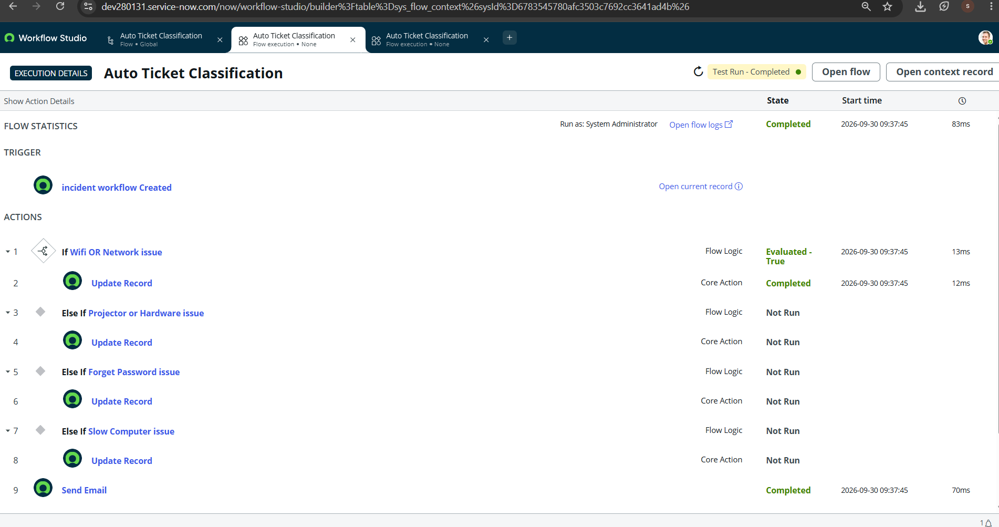
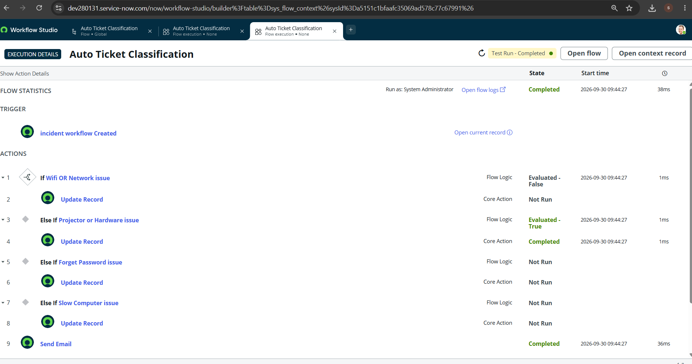
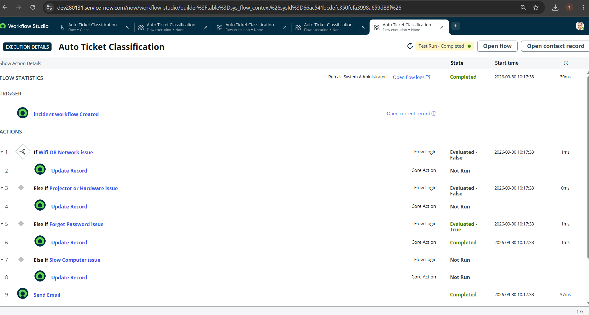
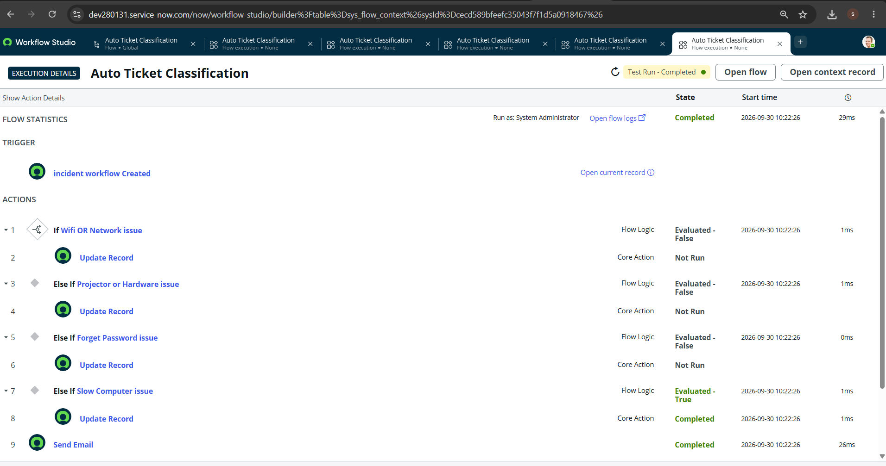
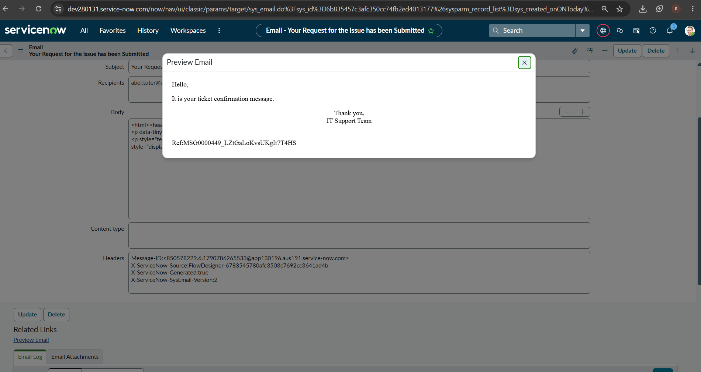

# 🎫 Auto Ticket Classification using Flow Designer

## 📌 Project Overview

**Auto Ticket Classification using Flow Designer** is a ServiceNow
automation project that automatically classifies IT support tickets
based on the issue described by the user.

The project reduces manual ticket classification by using **ServiceNow
Workflow Studio / Flow Designer** to inspect the ticket's short
description, assign the appropriate category and subcategory, and send
an automated confirmation email to the caller.

The project also includes a custom **Auto Ticket Classification** table
with structured fields for storing and managing ticket information.

------------------------------------------------------------------------

## 🎯 Problem Statement

In a typical IT helpdesk, users submit tickets for problems such as:

-   Wi-Fi or network issues
-   Hardware problems
-   Password reset requests
-   Slow computer/performance issues

Manually reviewing and categorizing every ticket takes time and can
result in inconsistent classification.

### 💡 Proposed Solution

The project uses ServiceNow Flow Designer to:

1.  Detect a newly created ticket.
2.  Read the ticket's short description.
3.  Match the issue against predefined conditions.
4.  Automatically assign the appropriate category and subcategory.
5.  Send an email confirmation to the caller.
6.  Store the ticket information in a structured custom table.

------------------------------------------------------------------------

## Technology Used

-   **ServiceNow**
-   **Workflow Studio / Flow Designer**
-   **ServiceNow Tables and Dictionary**
-   **Reference fields**
-   **Choice fields**
-   **Dependent fields**
-   **Automated Email**
-   **GitHub**

------------------------------------------------------------------------

# Custom Table

A custom table named:

**Auto Ticket Classification**

was created to store ticket-related information in a structured format.

### Fields

  Field               Type          Purpose
  ------------------- ------------- ------------------------------------
  Number              Auto Number   Unique ticket identification
  Caller              Reference     References `sys_user`
  Category            Choice        Main ticket category
  Subcategory         Choice        More specific issue classification
  Short Description   String        Short description of the issue
  Description         String        Detailed issue description
  State               Choice        Current ticket state
  Assigned Group      Reference     References `sys_user_group`
  Assigned To         Reference     References `sys_user`

### Category Choices

-   Network
-   Hardware
-   Access
-   Performance

### Subcategory Choices

-   Wi-Fi
-   Projector
-   Forgot Password
-   Slow Computer

### State Choices

-   New
-   In Progress
-   On Hold
-   Resolved
-   Closed

------------------------------------------------------------------------

# Category and Subcategory Dependency

A dependency relationship was configured between **Category** and
**Subcategory**.

The purpose is to make the available subcategory options depend on the
selected category.

The dependency is configured using the **Subcategory** field's
Dictionary configuration:

-   **Use Dependent Field:** True
-   **Dependent Field:** Category

This provides a structured relationship between the Category and
Subcategory fields.

------------------------------------------------------------------------

# Flow Design

The main flow is named:

**Auto Ticket Classification**

The flow is triggered when a new ticket/record is created.

### Flow Structure

``` text
Trigger: Incident/Ticket Created
          |
          v
   If Wi-Fi OR Network issue
          |
          v
      Update Record
          |
          v
   Else If Projector OR Hardware issue
          |
          v
      Update Record
          |
          v
   Else If Forgot Password issue
          |
          v
      Update Record
          |
          v
   Else If Slow Computer issue
          |
          v
      Update Record
          |
          v
       Send Email
```

The final flow contains four classification branches followed by an
automated email action.

------------------------------------------------------------------------

# Classification Rules

  Issue detected in Short Description   Category      Subcategory
  ------------------------------------- ------------- -----------------
  Wi-Fi / Network                       Network       Wi-Fi
  Projector / Hardware                  Hardware      Projector
  Forgot Password                       Access        Forgot Password
  Slow Computer                         Performance   Slow Computer

These rules allow the flow to classify common IT support requests
automatically.

------------------------------------------------------------------------

# Flow Conditions

## 1. Wi-Fi / Network Issue

The first condition checks whether the short description contains a
Wi-Fi or network-related issue.

If the condition evaluates to **True**, the corresponding Update Record
action runs.

**Result:**

`Category = Network`

`Subcategory = Wi-Fi`

The Network test successfully evaluated the first condition as **True**,
completed the Update Record action, and then completed the Send Email
action.

------------------------------------------------------------------------

## 2. Projector / Hardware Issue

The second branch checks for projector or hardware-related issues.

If the condition evaluates to **True**, the corresponding Update Record
action runs.

**Result:**

`Category = Hardware`

`Subcategory = Projector`

The Hardware test successfully evaluated this branch as **True**,
completed the Update Record action, and completed the Send Email action.

------------------------------------------------------------------------

## 3. Forgot Password Issue

The third branch checks whether the short description contains a
password-reset/forgot-password issue.

If the condition evaluates to **True**, the corresponding Update Record
action runs.

**Result:**

`Category = Access`

`Subcategory = Forgot Password`

The Forgot Password test successfully evaluated this branch as **True**,
completed the Update Record action, and completed the Send Email action.

------------------------------------------------------------------------

## 4. Slow Computer Issue

The fourth branch checks whether the short description contains a
slow-computer/performance issue.

If the condition evaluates to **True**, the corresponding Update Record
action runs.

**Result:**

`Category = Performance`

`Subcategory = Slow Computer`

The Slow Computer test successfully evaluated this branch as **True**,
completed the Update Record action, and completed the Send Email action.

------------------------------------------------------------------------

# Automated Email Notification

After the classification branches, the flow executes a **Send Email**
action.

The email is sent to the caller's email address using the reference:

``` text
Trigger → Record → Caller → Email
```

### Email Subject

**Your Request for the issue has been Submitted**

### Email Body

``` text
Hello,

It is your ticket confirmation message.

Thank you,
IT Support Team
```

The Send Email action was successfully executed during testing.

The ServiceNow email record also confirms that the email was generated
and contains the expected message content.

------------------------------------------------------------------------

# Testing and Validation

The flow was tested using different ticket scenarios.

## Test Case 1 --- Network

**Input:** Network / Wi-Fi issue

**Expected:**

-   Category → Network
-   Subcategory → Wi-Fi
-   Email → Sent

**Result:** ✅ Passed

The execution log shows:

-   Network condition → **Evaluated - True**
-   Update Record → **Completed**
-   Send Email → **Completed**

------------------------------------------------------------------------

## Test Case 2 --- Hardware

**Input:** Projector / Hardware issue

**Expected:**

-   Category → Hardware
-   Subcategory → Projector
-   Email → Sent

**Result:** ✅ Passed

The execution log shows:

-   Hardware condition → **Evaluated - True**
-   Update Record → **Completed**
-   Send Email → **Completed**

------------------------------------------------------------------------

## Test Case 3 --- Forgot Password

**Input:** Forgot Password issue

**Expected:**

-   Category → Access
-   Subcategory → Forgot Password
-   Email → Sent

**Result:** ✅ Passed

The execution log shows:

-   Forgot Password condition → **Evaluated - True**
-   Update Record → **Completed**
-   Send Email → **Completed**

------------------------------------------------------------------------

## Test Case 4 --- Slow Computer

**Input:** Slow Computer issue

**Expected:**

-   Category → Performance
-   Subcategory → Slow Computer
-   Email → Sent

**Result:** ✅ Passed

The execution log shows:

-   Slow Computer condition → **Evaluated - True**
-   Update Record → **Completed**
-   Send Email → **Completed**

------------------------------------------------------------------------

# Test Execution Summary

  Test Case   Condition              Category      Subcategory       Email   Status
  ----------- ---------------------- ------------- ----------------- ------- -----------
  1           Wi-Fi / Network        Network       Wi-Fi             Sent    ✅ Passed
  2           Projector / Hardware   Hardware      Projector         Sent    ✅ Passed
  3           Forgot Password        Access        Forgot Password   Sent    ✅ Passed
  4           Slow Computer          Performance   Slow Computer     Sent    ✅ Passed

All four classification scenarios were successfully tested.

------------------------------------------------------------------------

# Project Screenshots

> Place the provided screenshots in a `screenshots` folder using the
> filenames below.

### Flow Design


### Network Test



### Hardware Test



### Forgot Password Test



### Slow Computer Test



### Email Notification



------------------------------------------------------------------------

# Key Features

-   ✅ Automated ticket classification
-   ✅ Network issue classification
-   ✅ Hardware issue classification
-   ✅ Password reset classification
-   ✅ Performance/slow computer classification
-   ✅ Category and Subcategory fields
-   ✅ Category--Subcategory dependency
-   ✅ Structured custom ticket table
-   ✅ Reference fields for Caller, Assigned Group, and Assigned To
-   ✅ Choice fields for Category, Subcategory, and State
-   ✅ Automated email notification
-   ✅ Flow execution testing
-   ✅ GitHub project documentation

------------------------------------------------------------------------

# Project Benefits

### Reduced Manual Work

Tickets can be classified automatically instead of requiring manual
categorization for every request.

### Consistent Classification

Predefined rules provide a consistent classification structure.

### Faster Ticket Processing

The appropriate category and subcategory can be assigned immediately
after ticket creation.

### Automated Communication

The caller receives an automated confirmation email after the ticket is
processed.

### Structured Data

The custom table provides a standardized structure for storing ticket
information.

### Easy Maintenance

Additional classification rules can be added to the flow as new IT
support scenarios are introduced.

------------------------------------------------------------------------

# Future Enhancements

Possible future improvements include:

-   More IT issue categories and subcategories
-   Assignment of tickets to specific support groups
-   Priority calculation based on issue type
-   SLA automation
-   Automatic assignment of technicians
-   Dashboard and reporting
-   More advanced text-based classification
-   Integration with additional notification channels

------------------------------------------------------------------------

# What I Learned

Through this project, I learned how to:

-   Create and configure ServiceNow tables
-   Create fields with different data types
-   Configure Reference fields
-   Configure Choice fields
-   Create Category and Subcategory relationships
-   Configure dependent fields
-   Build automation using Flow Designer
-   Use conditions and Else If branches
-   Update records automatically
-   Configure automated email notifications
-   Test Flow Designer executions
-   Analyze execution results
-   Document a ServiceNow project using GitHub

------------------------------------------------------------------------

# Project Structure

``` text
Auto-Ticket-Classification--Servicenow/
│
├── README.md
├── screenshots/
│   ├── Auto_Ticket_Classification.png
│   ├── network_test.png
│   ├── hardware_test.png
│   ├── forgot_password_test.png
│   ├── slow_computer_test.png
│   └── Sent_email_check.png
│
└── ServiceNow Flow Designer Configuration
```

------------------------------------------------------------------------

# Team

**Team Lead** - Shivam Singh

**Team Members** - Allwin Vincent Raj Tj - Vikram Singh Gahlot - Chandan
Kumar Singh

------------------------------------------------------------------------

# GitHub Repository

**Repository:** `codershivaa/Auto-Ticket-Classification--Servicenow`

------------------------------------------------------------------------

# Project Status

**Status: Completed and Tested ✅**

The project flow, classification conditions, record updates,
category/subcategory configuration, dependent-field configuration, and
email notification have been implemented and tested successfully.

The four main test scenarios --- **Network, Hardware, Forgot Password,
and Slow Computer** --- completed successfully in Workflow Studio.

------------------------------------------------------------------------

## Conclusion

The **Auto Ticket Classification using Flow Designer** project
demonstrates how ServiceNow can automate a common IT helpdesk process.

By combining structured ticket fields, dependent Category/Subcategory
selection, Flow Designer conditions, automatic record updates, and email
notifications, the system provides a standardized workflow for handling
common IT support requests.
